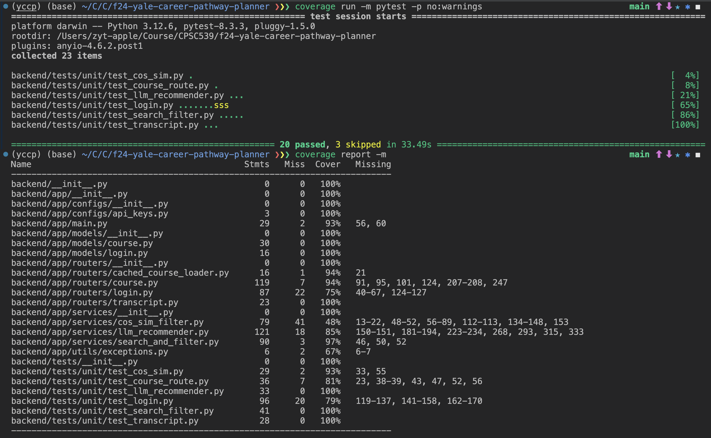

# Yale Career Pathway Planner
## Welcome to Yale CourseMap, see our project at https://yalecoursemap.com/


## Back End Setup
- Install Conda or Mamba
- Create the environment
  ```
  conda env create -f backend/environment.yml
  ```
- Install Package in editable mode
  ```
  pip install -e .
  ``` 
- Run `backend/app/services/YaleCoursePlannerKeyWordGenerator.py`
- Run the application with Uvicorn
  ```
  uvicorn backend.app.main:app --reload
  ```

## Backend Test
- Run the backend test with ``pytest``
- We have implemented unit tests for all backend functionalities, passed all tests, and achieved 86% coverage.


Here is the markdown table for the test results and coverage report in the image:

### Test Results
| File                           | Tests | Status   |
|--------------------------------|-------|----------|
| `test_cos_sim.py`              | 4%    | Passed   |
| `test_course_route.py`         | 8%    | Passed   |
| `test_tlm_recommender.py`      | 21%   | Passed   |
| `test_login.py`                | 65%   | Passed   |
| `test_search_filter.py`        | 86%   | Passed   |
| `test_transcript.py`           | 100%  | Passed   |

---

### Coverage Report
| File                                   | Statements | Miss | Coverage | Missing                      |
|---------------------------------------|------------|------|----------|------------------------------|
| `backend/__init__.py`                 | 0          | 0    | 100%     |                              |
| `backend/app/__init__.py`             | 0          | 0    | 100%     |                              |
| `backend/app/configs/__init__.py`     | 0          | 0    | 100%     |                              |
| `backend/app/configs/api_keys.py`     | 3          | 0    | 100%     |                              |
| `backend/app/main.py`                 | 29         | 2    | 93%      | 56, 60                       |
| `backend/app/models/__init__.py`      | 0          | 0    | 100%     |                              |
| `backend/app/routers/cached_loader.py`| 16         | 1    | 94%      | 21                           |
| `backend/app/routers/course.py`       | 119        | 7    | 94%      | 91, 95, 101, 124, 207-208, 247 |
| `backend/app/routers/transcript.py`   | 23         | 0    | 100%     |                              |
| `backend/app/services/__init__.py`    | 0          | 0    | 100%     |                              |
| `backend/app/services/cos_sim_filter.py` | 79      | 41   | 48%      | 13-22, 48-52, 56-89, 112-113, 134-148, 153 |
| `backend/app/services/tlm_recommender.py`| 121     | 18   | 85%      | 150-151, 181-194, 223-234, 268, 293, 315, 333 |
| `backend/app/services/search_filter.py` | 90       | 3    | 96%      | 46, 50, 52                   |
| `backend/app/utils/exceptions.py`     | 6          | 2    | 67%      | 6-7                          |
| `backend/tests/__init__.py`           | 0          | 0    | 100%     |                              |
| `backend/tests/unit/test_cos_sim.py`  | 29         | 2    | 93%      | 33, 55                       |
| `backend/tests/unit/test_course_route.py` | 36     | 7    | 81%      | 23, 38-39, 43, 47, 52, 56   |
| `backend/tests/unit/test_tlm_recommender.py` | 33   | 0    | 100%     |                              |
| `backend/tests/unit/test_login.py`    | 30         | 6    | 79%      | 119-137, 141-158, 162-170   |
| `backend/tests/unit/test_search_filter.py` | 41    | 0    | 100%     |                              |
| `backend/tests/unit/test_transcript.py` | 28      | 0    | 100%     |                              |


## Front End Setup
- Install Node.js
- cd to Frontend folder
  ```
  cd frontend
  ```
- Run npm install and then run npm start
  ```
  npm install
  npm start
  ```
- should be able to see it running locally on port 3000

## Frontend Test
- Run the following command to run unit test for frontend
```
npm test
```
- We have achieved 86.13% statement coverage for frontend code


Please note that all files (such as App.js) that are directly under src are auto generated by React, thus we do not provide unit tests for those js files

Here is the markdown table for the coverage results shown in the image:

### Coverage Report

| File                               | % Stmts | % Branch | % Funcs | % Lines | Uncovered Line #s       |
|------------------------------------|---------|----------|---------|---------|-------------------------|
| **All files**                      | 86.9    | 80       | 88.75   | 86.13   |                         |
| `src`                              | 0       | 0        | 0       | 0       |                         |
| `App.js`                           | 0       | 0        | 0       | 0       | 9                       |
| `index.js`                         | 100     | 100      | 100     | 100     |                         |
| `reportWebVitals.js`               | 0       | 0        | 0       | 0       | 1-8                     |
| `src/Components`                   | 91.25   | 84.21    | 92.2    | 90.7    |                         |
| `AboutUs.js`                       | 100     | 100      | 100     | 100     |                         |
| `Calendar.js`                      | 100     | 100      | 100     | 100     |                         |
| `ContentSection.js`                | 100     | 100      | 100     | 100     |                         |
| `CourseDetailsTooltip.js`          | 100     | 100      | 100     | 100     |                         |
| `CourseMap.js`                     | 94.11   | 100      | 93.33   | 94.11   | 340                     |
| `Header.js`                        | 100     | 100      | 100     | 100     |                         |
| `Loading.js`                       | 100     | 100      | 100     | 100     |                         |
| `QuotesSection.js`                 | 100     | 100      | 100     | 100     |                         |
| `RecommendationList.js`            | 100     | 50       | 100     | 100     | 17                      |
| `SearchBar.js`                     | 100     | 100      | 100     | 100     |                         |
| `TeamMember.js`                    | 100     | 100      | 100     | 100     |                         |
| `TooltipIcon.js`                   | 100     | 100      | 100     | 100     |                         |
| `main.js`                          | 82.69   | 66.66    | 70      | 82.69   | 39-44, 49, 82-84        |
| `scheduleDisplay.js`               | 85.71   | 66.64    | 90.9    | 83.82   | 76-79, 93, 114-119      |
| `utils.js`                         | 100     | 93.1     | 100     | 100     | 20, 84                  |

---

### Test Summary
- **Test Suites:** 7 passed, 7 total
- **Tests:** 45 passed, 45 total
- **Snapshots:** 0 total
- **Time:** 3.181 seconds


## Current Pipeline
- Offline: Precompute word embeddings for all courses offline
- Online:
  1. Convert input formats of time and taken courses
  2. Filter based on time and taken courses
  3. Perform cosine similarity to find suitable courses
  4. Use LLM to finalize the output

## Code Documentation

### Backend
- `backend/app/main.py`: Entry point for the FastAPI server
- `backend/app/routers/`: Contains all the routers for the backend
- `backend/app/routers/course.py`: Router for course recommendation
- `backend/app/routers/login.py`: Router for user login
- `backend/app/routers/transcript.py`: Router for transcript parsing
- `backend/services/`: Contains all the services for the backend
- `backend/services/cos_sim_filter.py`: Cosine similarity filtering for retrival augmented generation
- `backend/services/llm_recommender.py`: LLM recommender using OpenAI API
- `backend/models/`: Contains all the data models for the backend
- `backend/models/course.py`: Data model for course recommendation request
- `backend/models/login.py`: Data model for user login
- `backend/tests/`: Contains test files for backend functionality

### Frontend
- `frontend/src/`: Contains React application source code
- `frontend/src/components/`: React components
- `frontend/src/tests/`: Test files using Jest and React Testing Library


### Tests
- Backend tests use pytest framework with coverage reporting
- Frontend tests use Jest and React Testing Library
- Mock services are implemented for external API dependencies
- Integration tests ensure end-to-end functionality


## Project Structure

```
yale-course-planner/
├── backend/                  # Backend FastAPI application
│   ├── app/                 # Main application code
│   │   ├── main.py         # FastAPI entry point
│   │   ├── routers/        # API route handlers
│   │   └── services/       # Business logic services
│   ├── models/             # Data models and schemas
│   ├── tests/              # Backend test files
│   └── environment.yml     # Conda environment specification
├── frontend/               # React frontend application
│   ├── src/               # Source code
│   │   ├── components/    # React components
│   │   └── tests/        # Frontend test files
│   ├── package.json       # Node.js dependencies
│   └── public/           # Static assets
├── assets/                # Project assets and images
└── README.md             # Project documentation